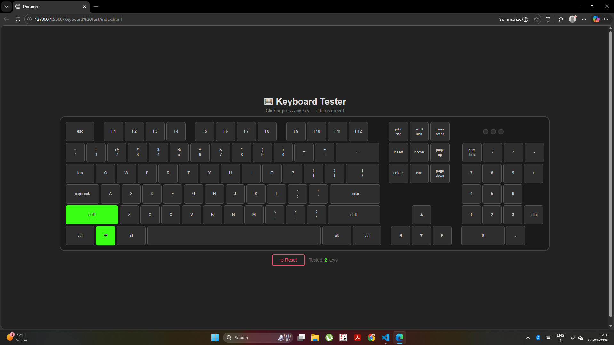

# ⌨ Keyboard Tester

A lightweight, browser-based keyboard tester that lets you verify every key on your keyboard works correctly. Click or press any key — it lights up green!

## Features

- **Full keyboard layout** — covers all standard keys including function keys, numpad, arrow keys, and modifier keys
- **Click or press** — works with both mouse clicks and physical keypresses
- **Visual feedback** — tested keys turn bright green so you can easily track what's been tested
- **Key counter** — tracks how many unique keys have been tested
- **Responsive scaling** — the keyboard scales automatically to fit any screen size
- **Reset button** — clears all tested keys and resets the counter

## Preview



## Getting Started

No build tools or dependencies required. Just open the file in your browser.

```bash
# Clone or download the project, then open index.html
open index.html
```

Or serve it with any local dev server:

```bash
# Using VS Code Live Server, Python, etc.
python -m http.server 5500
```

Then visit `http://localhost:5500` in your browser.

## File Structure

```
keyboard-tester/
├── index.html   # Keyboard layout markup
├── style.css    # Dark theme styling and key size variants
├── script.js    # Key press logic, scaling, and reset
└── README.md
```

## How It Works

- The keyboard is rendered at a fixed 1400px width using HTML `div` elements, each with a `data-key` attribute matching the browser's `event.code` values.
- JavaScript listens for `keydown` events and matches them to the on-screen keys via `querySelector('[data-key="..."]')`.
- A CSS `transform: scale()` is applied dynamically so the layout fits any viewport without breaking proportions.

## Browser Compatibility

Works in all modern browsers (Chrome, Firefox, Edge, Safari). No external libraries or frameworks required.

## License

MIT — free to use and modify.
